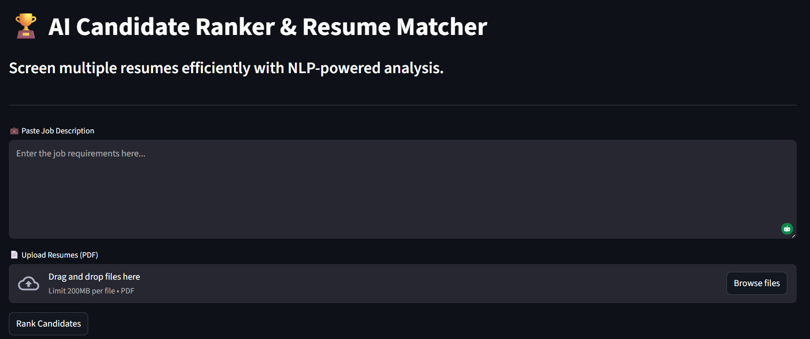

# AI-Powered Candidate Ranking & Resume Analytics System

Welcome to my end-to-end Data Science project! This repository showcases the journey of building an automated hiring tool—from initial data exploration to a fully functional web application.

---

## Project Overview
This project is divided into two major phases:
1. **Data Exploration & Analysis:** Analyzing job datasets and candidate resumes using Python and Pandas.
2. **Product Deployment:** An interactive AI app that ranks multiple PDF resumes against a job description using NLP.

---

##  Phase 1: Data Analysis (Python)
In this phase, I explored a dataset of job descriptions and resumes to understand key hiring trends.
- **Key Tasks:** Data cleaning, Text preprocessing, and calculating similarity scores between candidates.
- **Tools Used:** Pandas, Matplotlib, Seaborn, Scikit-learn.

##  Phase 2: Live AI Ranking App (Streamlit)
I transformed the core logic into a user-friendly application where HR teams can upload actual PDF files and get instant rankings.

###  App Features:
- **Bulk PDF Processing:** Upload multiple resumes simultaneously.
- **NLP Engine:** Uses **TF-IDF Vectorization** and **Cosine Similarity** to calculate accuracy.
- **Real-time Ranking:** Automatically identifies the best-fitting candidate.

---

##  Installation & Setup
To run the app locally, follow these steps:

1. Clone the repository: `git clone https://github.com/ZannatUSM/AI-Resume-Ranker.git`
2. Install dependencies: `pip install -r app/requirements.txt`
3. Run the app: `streamlit run app/app.py`

---

##  Project Visualization
Below is a snapshot of the AI Candidate Ranker in action:

---

##  Author
**Zannatul Sanzida**
Aspiring Data Scientist | Developer
[[LinkedIn Profile Link](https://www.linkedin.com/in/zannatul-sanzida-705a71203/)] | [[GitHub Profile Link](https://github.com/ZannatUSM)]
